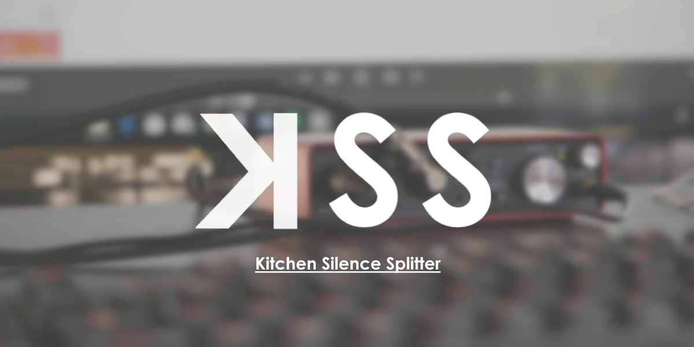

# KSS v7 

KSS v7 coming soon… stay tuned!

The Kitchen Silence Splitter, or KSS, is a python program that trims videos based on their volume level.

__Note:__ This repository also contains many other scripts that are useful for power user file management.

## Usage

### Running the Program

Find the most recent version (__kss6.py__) and run it.  Don't forget to check options.txt!

```python
python kss6.py
```

The completed file will show up in the folder named __output__ by default.

## Contributing
Feel free to fork and make something awesome!

## License
[GNU](https://www.gnu.org/licenses/gpl-3.0.en.html)

https://www.gnu.org/licenses/gpl-3.0.en.html)

## Similar Projects

Make sure to check out [reVos](https://github.com/dupontinquiries/reVos) if you are looking for KSS functionality in your browser.
